  

## 🚀 Tech Stack

 

## 📚 Learning

  

## 📊 GitHub Stats

  

### 🕹 Contribution Graph
  

<picture>
  <source media="(prefers-color-scheme: dark)" srcset="https://raw.githubusercontent.com/faveroo/faveroo/output/pacman-contribution-graph-dark.svg">
  <source media="(prefers-color-scheme: light)" srcset="https://raw.githubusercontent.com/faveroo/faveroo/output/pacman-contribution-graph.svg">
  
</picture>

