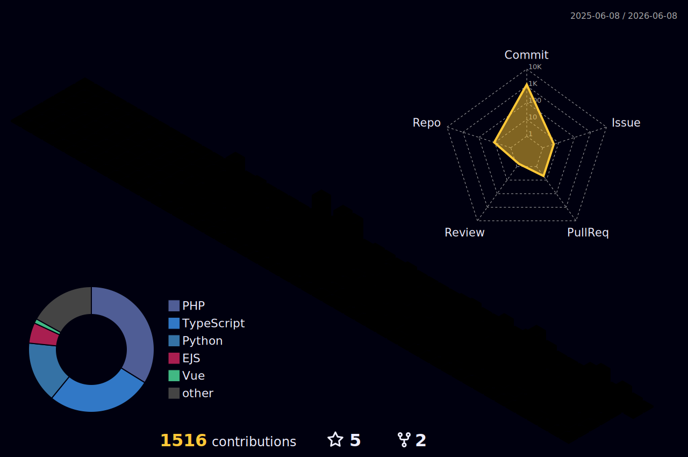

---

## 👨‍💻 Sobre mim

🎓 Estudante de **Análise e Desenvolvimento de Sistemas**  
💻 Focado em **desenvolvimento web full stack**  
🚀 Buscando evoluir com projetos práticos e bem estruturados  
📍 Brasil

---

## 🚀 Tecnologias que utilizo

 
   
   
   
   
   
   

---

## 📚 Atualmente aprendendo

 
   
   
   

---

  

---

## 📈 Estatísticas do GitHub

  
  

---

## ✨ Obrigado por visitar meu perfil!

  

