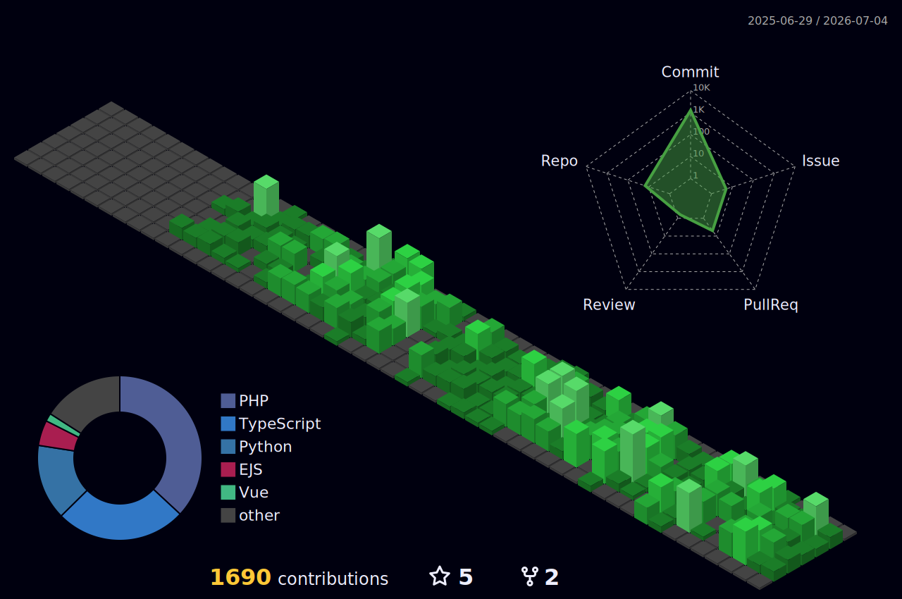

  

  <h3>Full Stack Developer in Training 🚀</h3>
  
Transformando ideias em código e café em soluções eficientes.

  

    <!--  -->
    
  

---

## 👨‍💻 Sobre Mim

Sou estudante de **Análise e Desenvolvimento de Sistemas**, apaixonado por construir aplicações que resolvem problemas reais. Atualmente, meu foco está no ecossistema **Full Stack**, equilibrando a robustez do Back-end com a fluidez do Front-end.

* 📍 Brasil.
* 🎓 Focado em arquitetura de software e boas práticas.
* 🌱 Em constante evolução com **Laravel, Vue e React**.

---

## 🛠️ Stack Tecnológica

### Core Skills

  

### Expandindo o Horizonte (Learning)

  

---

## 📊 Atividade no GitHub

 

  
  

<!--

  

-->

---

  
<i>"A única maneira de fazer um excelente trabalho é amar o que você faz."</i>

  

