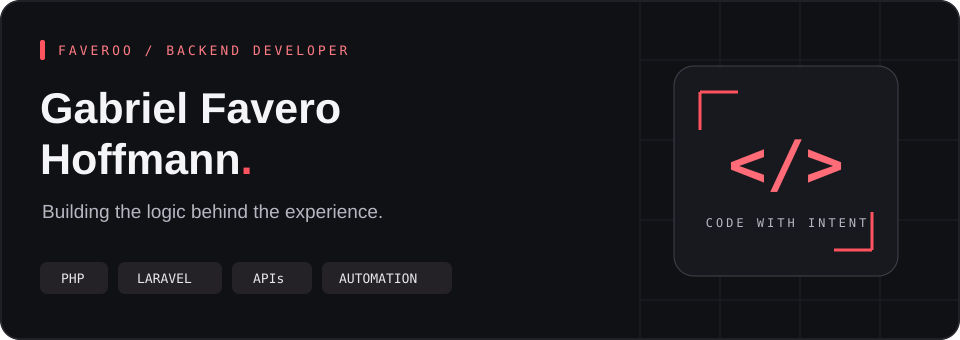
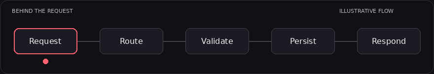

<p align="center">
  
</p>

<p align="center">
  <a href="#selected-projects">Selected projects</a> &nbsp; / &nbsp;
  <a href="#toolbox">Toolbox</a> &nbsp; / &nbsp;
  <a href="#github-in-numbers">GitHub stats</a> &nbsp; / &nbsp;
  <a href="#lets-connect">Contact</a>
</p>

### Turning business rules into useful software.

I'm **Gabriel**, a backend developer focused on **PHP and Laravel**, currently studying **Systems Analysis and Development**. I build web applications and explore API design, relational data modeling and automation — with an interest in code that is easy to understand, test and evolve.

- **My focus:** backend development, REST APIs and application architecture.
- **Beyond the backend:** React, TypeScript and Inertia.js to connect business logic to usable interfaces.
- **Currently building:** Eventide, a project exploring application monitoring and incident management.

```php
<?php

// A little about the developer behind these repositories.
return [
    'name'  => 'Gabriel Favero Hoffmann',
    'stack' => ['PHP', 'Laravel', 'MySQL'],
    'focus' => ['APIs', 'Automation', 'Maintainable software'],
];
```

<p align="center">
  
</p>

## Selected projects

<table>
<tr>
<td width="50%" valign="top">

**01 / OBSERVABILITY**

### [Eventide ↗](https://github.com/faveroo/eventide)

**Understand what is happening across a team's applications.**

A platform in development for application monitoring and incident management. The proposal brings health checks, application events and external integrations into one operational view.

**Engineering focus:** organizations and access control, API design, event processing and observability.

<sub>In development · Monitoring and incident detection are project goals.</sub>

<br><br>
[Explore the architecture →](https://github.com/faveroo/eventide#readme)

</td>
<td width="50%" valign="top">

**02 / FULL-STACK APPLICATION**

### [Bill Subscription Manager ↗](https://github.com/faveroo/bill-subscription-manager)

**Bring recurring expenses into one place.**

A web application to manage subscriptions, billing cycles and payment history, with a dashboard for upcoming charges and projected recurring costs.

**Engineering focus:** subscription lifecycles, user-scoped data, notifications and typed interfaces.

<sub>Laravel · React · Inertia.js · TypeScript</sub>

<br><br>
[Explore the application →](https://github.com/faveroo/bill-subscription-manager#readme)

</td>
</tr>
</table>

## Toolbox

<p>
  
</p>

| Area | Technologies & practices |
| :--- | :--- |
| **Backend & data** | PHP · Laravel · Eloquent · MySQL · REST APIs · Sanctum |
| **Interfaces** | React · TypeScript · Inertia.js |
| **Quality** | Pest / PHPUnit · PHPStan / Larastan · Laravel Pint |
| **Workflow** | Git · GitHub Actions · Composer · Python |

## GitHub in numbers

<p align="center">
  
</p>

<sub>Public GitHub data, refreshed daily. Language counts describe repositories' primary languages, not proficiency or lines of code. Stars and forks refer to original, non-archived projects, excluding this profile.</sub>

<details>
<summary><strong>Recently updated repositories</strong></summary>

<!-- RECENT-WORK:START -->
- **[cache](https://github.com/faveroo/cache)** — Public repository `PHP`
- **[eventide](https://github.com/faveroo/eventide)** — Public repository `PHP`
- **[discord-bot](https://github.com/faveroo/discord-bot)** — Public repository `Python`
<!-- RECENT-WORK:END -->

</details>

## One contribution at a time

<picture>
  <source media="(prefers-color-scheme: dark)" srcset="./dist/github-contribution-grid-snake-dark.svg">
  <source media="(prefers-color-scheme: light)" srcset="./dist/github-contribution-grid-snake.svg">
  
</picture>

## Let's connect

Interested in my work? **Explore the projects above** or connect with me on **[GitHub @faveroo](https://github.com/faveroo)**.

<p align="center"><sub>Gabriel Favero Hoffmann &nbsp; · &nbsp; Backend development &nbsp; · &nbsp; Built with purpose.</sub></p>
