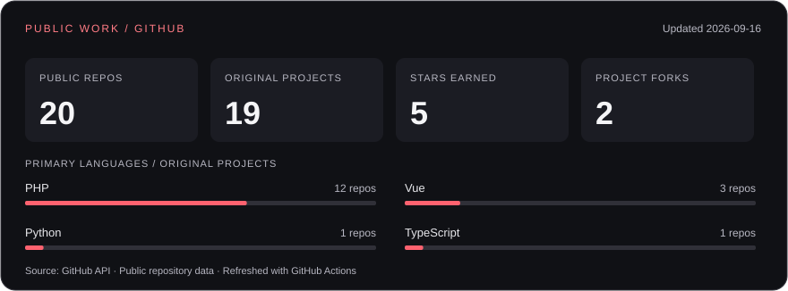

  

 

  

## About me

Backend developer working primarily with **PHP** and **Laravel**, with a focus on **APIs, software architecture, automation, code quality and developer tooling**. I am currently pursuing a degree in **Systems Analysis and Development (ADS)** and use my public repositories to explore maintainable application design, reusable packages and engineering workflows.

I like codebases where architecture is explicit, quality checks are part of the workflow, and abstractions earn their place by making the system easier to understand and evolve.

## Tech stack

<table>
  <tr>
    <td><strong>Backend</strong></td>
    <td>
      
      &nbsp;PHP&nbsp;&nbsp;
      
      &nbsp;Laravel&nbsp;&nbsp;
      
      &nbsp;Composer
    </td>
  </tr>
  <tr>
    <td><strong>Data & APIs</strong></td>
    <td>
      
      &nbsp;MySQL&nbsp;&nbsp;·&nbsp;&nbsp;REST APIs&nbsp;&nbsp;·&nbsp;&nbsp;Laravel Sanctum
    </td>
  </tr>
  <tr>
    <td><strong>Frontend</strong></td>
    <td>
      
      &nbsp;React&nbsp;&nbsp;
      
      &nbsp;TypeScript&nbsp;&nbsp;·&nbsp;&nbsp;Inertia.js
    </td>
  </tr>
  <tr>
    <td><strong>Quality & tooling</strong></td>
    <td>
      
      &nbsp;Git&nbsp;&nbsp;·&nbsp;&nbsp;GitHub Actions&nbsp;&nbsp;·&nbsp;&nbsp;Pest / PHPUnit&nbsp;&nbsp;·&nbsp;&nbsp;PHPStan / Larastan&nbsp;&nbsp;·&nbsp;&nbsp;Laravel Pint
    </td>
  </tr>
  <tr>
    <td><strong>Also used</strong></td>
    <td>
      
      &nbsp;Python
    </td>
  </tr>
</table>

## Featured projects

<table>
<tr>
<td width="50%" valign="top">

### [Eventide](https://github.com/faveroo/eventide)

Application monitoring and incident-management platform for development teams, built around health checks, application events and external integrations.

**Why it is interesting:** explores event-driven architecture, queues, webhooks, API authentication, detection rules, multi-tenancy and observability in Laravel.

</td>
<td width="50%" valign="top">

### [bill-subscription-manager](https://github.com/faveroo/bill-subscription-manager)

Full-stack recurring-expense manager using Laravel 13, React, Inertia.js and TypeScript.

**Why it is interesting:** models subscription lifecycles, billing history and notifications while keeping linting, formatting, type checks and tests in the development workflow.

</td>
</tr>
</table>

## GitHub & open-source activity

  

### Recent work

<!-- RECENT-WORK:START -->
- **[eventide](https://github.com/faveroo/eventide)** — Public repository `PHP`
- **[discord-bot](https://github.com/faveroo/discord-bot)** — Public repository `Python`
- **[php-design-patterns](https://github.com/faveroo/php-design-patterns)** — Public repository `PHP`
<!-- RECENT-WORK:END -->

This section and the metrics card are refreshed automatically from public GitHub repository data.

## Contributions

<picture>
  <source media="(prefers-color-scheme: dark)" srcset="./dist/github-contribution-grid-snake-dark.svg">
  <source media="(prefers-color-scheme: light)" srcset="./dist/github-contribution-grid-snake.svg">
  
</picture>

## Contact

The best way to reach me around code or open-source work is through **GitHub** — repositories, issues and discussions are all public on [@faveroo](https://github.com/faveroo).

---

  Backend engineering · PHP · Laravel · APIs · automation · clean code

